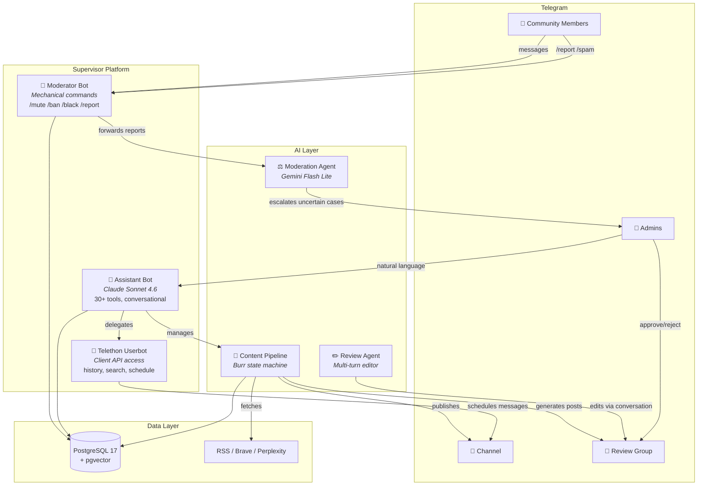
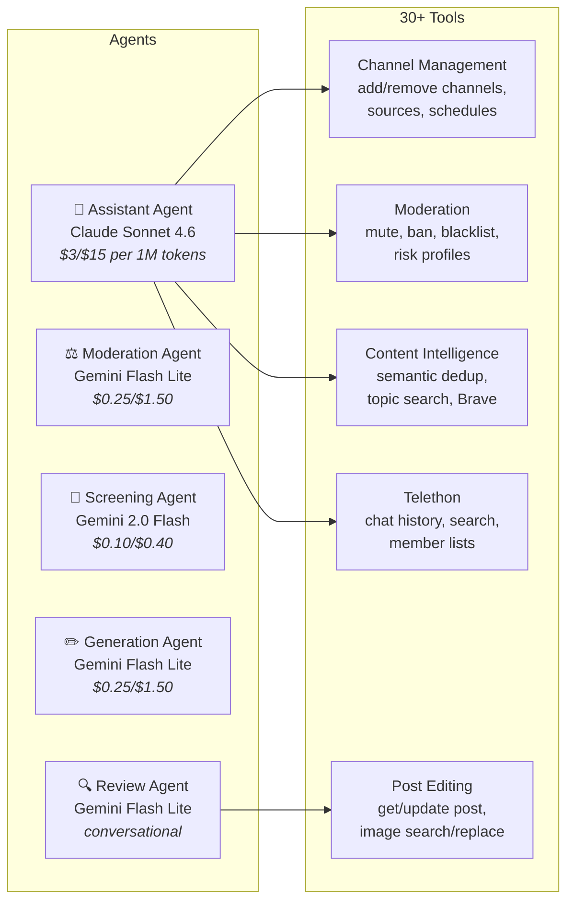
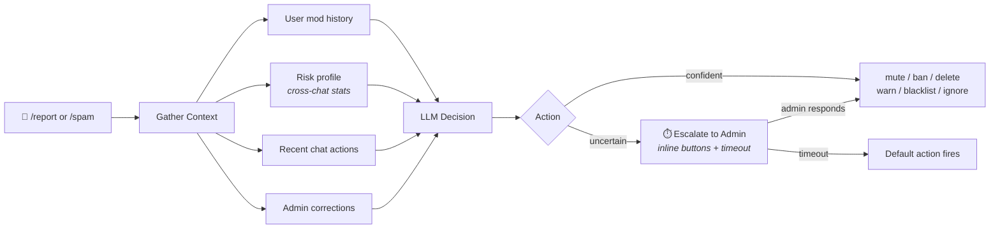
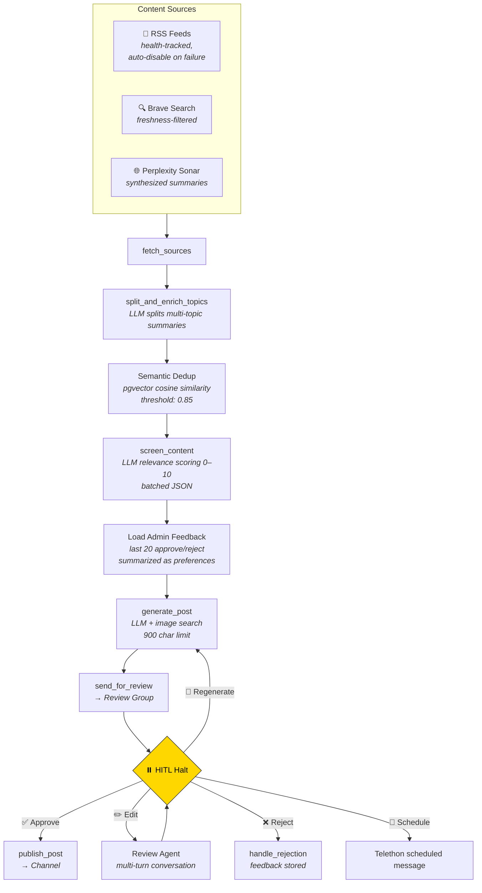

<h1 align="center">Supervisor Telegram</h1>

<p align="center">
  <em>AI-powered community management platform for Telegram</em>
</p>

<p align="center">
  
  
  
  
  
  
  
</p>

---

> **Alpha** — actively developed, core features working in production but APIs and architecture may change.

A multi-agent system that manages Telegram communities and automates content pipelines. A general-purpose platform combining **mechanical moderation**, **AI-driven content generation**, and a **conversational admin interface**.

The system runs **three separate Telegram identities** working in concert: a rule-enforcing moderator bot, an LLM-powered assistant, and a Telethon userbot for Client API features unavailable to standard bots.

## What's New

Recent reliability and quality improvements included in this update:

- **Escalation race condition fixed** — admin resolution and timeout handling now use atomic guarded updates, so only one path can finalize an escalation
- **Review/publish workflow hardened** — safer approve/reject/publish flow with better slot reservation, publish failure handling, and scheduled-post rejection behavior
- **Source toggle fixed** — assistant source on/off actions now target source IDs instead of URL prefixes
- **Moderation prompt sanitization improved** — reported messages and recent context are sanitized before entering LLM prompts
- **/report and /spam throttling added** — duplicate reports are deduplicated and repeated spam-report abuse is rate-limited
- **Type-check and callback safety cleanup** — several Optional/callback/Telethon typing edges were fixed
- **CI and local setup tightened** — pinned `uv sync` flow for Python 3.12, Alembic smoke verification in CI, and safer cleanup behavior
- **Integration tests behave correctly without Docker** — Docker-backed PostgreSQL tests are now skipped cleanly when no Docker daemon is available instead of failing during setup

## System Architecture



## Agent Architecture

The platform uses **PydanticAI** agents with typed dependencies and structured outputs, all routed through **OpenRouter** to access different models at different cost/capability tiers.



### Moderation Agent

The moderation agent receives reports and spam flags, gathers context through 4 information-gathering tools, and returns a typed `ModerationResult` with one of 7 possible actions.

**Self-calibrating**: Before each run, the 5 most recent admin override corrections are injected into the system prompt — the agent learns from where humans disagreed with it.



### Content Pipeline

A **Burr state machine** orchestrates the full content lifecycle — from source fetching to publication — with a human-in-the-loop review step that halts execution until an admin approves.



**Feedback loop**: The pipeline learns from admin decisions. Before generating each post, it summarizes the last 20 approve/reject decisions into preference bullets and injects them into the generation prompt.

**Source discovery**: Periodically, Perplexity Sonar discovers new RSS feeds for each channel's topic. Each discovered URL is validated by actually fetching it and passes SSRF checks before being stored.

### Assistant Bot

A conversational interface where admins manage everything through natural language. The PydanticAI agent has access to **30+ tools** across 5 domains and maintains per-user conversation history with safe trimming that respects tool call boundaries.

```
Admin: "Run the pipeline for @my_channel"
{🔧 Channel status} ✓ — @my_channel: active
{🔧 Run pipeline} ✓

Pipeline started for @my_channel. 3 sources will be fetched,
screened, and sent to review.
```

```
Admin: "Ban user 123456 in all chats"
{🔧 User info} ✓ — User: @spammer, 47 messages across 3 chats
{🔧 Add to blacklist} ✓

User @spammer added to global blacklist.
Messages revoked in 3 chats.
```

## Key Features

| Area | What it does |
|---|---|
| **Brand Voice Engine** | Auto-analyzes channel posts to extract unique writing style. Multiple voice presets (degen, serious, meme). All generations match your tone automatically |
| **Multi-Language Translation** | Translate posts to 13+ languages while preserving your brand voice — tone, slang, emoji patterns stay consistent |
| **Analytics Reports** | Weekly/monthly reports: engagement, best posts, LLM costs, approval rates, actionable recommendations |
| **AI Moderation** | LLM-based message analysis with self-calibrating decisions, admin escalation with timeout, cross-chat risk profiles |
| **Content Pipeline** | Automated fetch → screen → generate → review → publish with Burr state machine and HITL |
| **Semantic Dedup** | pgvector embeddings prevent duplicate topics across a configurable time window |
| **Conversational Review** | Multi-turn post editing through natural language in a Telegram review group |
| **Admin Feedback Loop** | Generation learns from past approve/reject decisions |
| **Source Management** | RSS health tracking, auto-discovery via Perplexity Sonar, SSRF-protected validation |
| **Scheduled Publishing** | Telegram Client API (Telethon) for native scheduled messages |
| **Content Calendar** | `/calendar` — 7-day view of scheduled posts with best-time recommendations |
| **Competitor Intelligence** | Monitor competitor channels, track posting frequency and top topics |
| **Engagement Prediction** | LLM-based scoring before publication: 🟢/🟡/🔴 with view estimates |
| **Smart Notifications** | Viral post alerts (2x+ views), LLM cost alerts, with cooldown anti-spam |
| **Startup Health Checks** | Auto-validates DB, Bot API, OpenRouter, Telethon on startup with graceful degradation |
| **Setup Wizard** | `/setup` command guides new admins through channel configuration step by step |
| **Mechanical Moderation** | /mute, /ban, /blacklist, welcome messages, spam detection — no LLM overhead |
| **Cost Tracking** | Per-operation LLM cost breakdown with cache savings, persisted to DB |
| **600+ Tests** | Unit, integration, e2e with FakeTelegramServer and testcontainers |

### Brand Voice Engine

Most content bots generate generic text. Supervisor learns **your** writing style.

```
Admin: "Analyze the channel voice"
{🔧 Analyze channel voice} ✓ — 50 posts analyzed

Voice profile "default" saved:
  Tone: casual degen, like texting a friend
  Addressing: ты/пацаны
  Emoji: medium density
  Signature phrases: "лутаем халяву 🤙", "DYOR", "пока лавочку не прикрыли"
  Forbidden: bullet points, corporate tone, press-release style
```

After analysis, **all generated posts automatically match your style** — no manual prompt tuning needed. Create multiple presets for different moods:

```
Admin: "Analyze voice as 'serious' preset"
Admin: "Analyze voice as 'meme' preset"
```

## Why Supervisor is Different

| Feature | Combot | Shieldy | Rose Bot | Generic AI Bot | **Supervisor** |
|---|:---:|:---:|:---:|:---:|:---:|
| Spam moderation | ✅ | ✅ | ✅ | ❌ | ✅ AI + rules |
| Content generation | ❌ | ❌ | ❌ | ✅ generic | ✅ **your voice** |
| Brand Voice learning | ❌ | ❌ | ❌ | ❌ | ✅ |
| Multi-language + tone | ❌ | ❌ | ❌ | ❌ | ✅ |
| HITL review workflow | ❌ | ❌ | ❌ | ❌ | ✅ |
| Semantic dedup | ❌ | ❌ | ❌ | ❌ | ✅ pgvector |
| Analytics reports | ❌ | ❌ | ❌ | ❌ | ✅ |
| Self-calibrating AI | ❌ | ❌ | ❌ | ❌ | ✅ learns from corrections |
| Admin feedback loop | ❌ | ❌ | ❌ | ❌ | ✅ |
| Conversational admin | ❌ | ❌ | ❌ | partial | ✅ 30+ tools |
| Cost tracking | ❌ | ❌ | ❌ | ❌ | ✅ per-operation |
| Open source | ❌ | ✅ | ❌ | varies | ✅ MIT |

## Tech Stack

| Layer | Technologies |
|---|---|
| **Bot Framework** | aiogram 3.x, Telethon (Client API) |
| **AI/Agents** | PydanticAI, OpenRouter (Claude Sonnet, Gemini Flash, Perplexity Sonar) |
| **State Machine** | Burr (checkpointable HITL workflow) |
| **Database** | PostgreSQL 17 + pgvector, SQLAlchemy 2.x async, Alembic |
| **Search** | Brave Search API (web + images), Perplexity Sonar (synthesis) |
| **Architecture** | Feature-based modular (moderation/channel/assistant), service locator DI |
| **Quality** | ruff, ty (Astral type checker), pytest, pre-commit, structlog |
| **Infrastructure** | Docker multi-stage, uv package manager |

## Project Structure

> See [`docs/architecture.md`](docs/architecture.md) for full module map, config hierarchy, data flow, and design decisions.

```
app/
├── core/                   # Config, logging, DI container, enums, healthcheck
├── moderation/             # AI moderation: agent, escalation, blacklist, report
├── agent/
│   └── channel/            # Content pipeline
│       ├── orchestrator.py # Per-channel scheduling + graceful shutdown
│       ├── workflow.py     # Burr state machine (10 actions)
│       ├── generator.py    # LLM screening + post generation
│       ├── brand_voice.py  # Brand Voice Engine (cached style profiles)
│       ├── reports.py      # Analytics + competitor intelligence reports
│       ├── notifications.py# Smart alerts (viral posts, cost spikes)
│       ├── translate.py    # Multi-language translation with voice
│       ├── review/         # Review submodule (agent, presentation, service)
│       ├── semantic_dedup.py
│       ├── sources.py      # RSS fetching + health tracking
│       └── http.py         # SSRF-protected HTTP client
├── assistant/              # Conversational admin bot
│   ├── agent.py            # PydanticAI agent
│   ├── commands.py         # /stats /sources /settings /calendar /setup /healthcheck
│   ├── bot.py              # Conversation management
│   └── tools/              # 35+ tools across 7 modules
├── infrastructure/         # DB models, BaseRepository, Telethon client
└── presentation/           # Telegram handlers, middlewares
```

## Quick Start

### Prerequisites

- **Python 3.12** and [uv](https://docs.astral.sh/uv/) (for local dev)
- **PostgreSQL 17** with [pgvector](https://github.com/pgvector/pgvector) extension
- **Telegram Bot Token** from [@BotFather](https://t.me/BotFather)
- **OpenRouter API Key** from [openrouter.ai](https://openrouter.ai) (for AI features)

### One-Command Install (Docker)

```bash
curl -fsSL https://raw.githubusercontent.com/Anda4ka/telegram-supervisor/main/install.sh | bash
```

The script checks Docker, clones the repo, walks you through 3 questions (bot token, admin ID, OpenRouter key), generates `.env`, and starts everything with `docker compose up -d`.

### Manual Docker Setup

```bash
git clone https://github.com/Anda4ka/telegram-supervisor.git
cd telegram-supervisor
cp .env.example .env   # fill in tokens, DB credentials, API keys

# All-in-one: bot + PostgreSQL + pgvector
docker compose -f docker-compose.full.yaml up -d

# Or dev mode (builds from source):
docker compose up -d
```

Migrations run automatically on startup via `scripts/entrypoint.sh`. AI features gracefully disable if `OPENROUTER_API_KEY` is not set.

### Local Development

```bash
git clone https://github.com/Anda4ka/telegram-supervisor.git
cd telegram-supervisor
cp .env.example .env   # fill in tokens, set DB_HOST=localhost

# Start PostgreSQL (skip if you have your own)
docker compose up -d db

# Install dependencies + run
uv sync --frozen --dev --python 3.12
uv run alembic upgrade head
uv run -m app.presentation.telegram
```

### Utility Scripts

```bash
uv run python auth_telethon.py        # First-time Telethon session auth
uv run python list_channels.py        # List all accessible channels/groups
uv run python dump_channel_posts.py   # Dump channel posts for style analysis
```

### Test & Validation

```bash
# Full repository check
uv run pytest -q
uv run ruff check app tests
uv run ty check

# Optional: verify DB migrations locally
uv run alembic upgrade head
```

Notes:

- Integration tests that require **PostgreSQL via testcontainers** need a working Docker daemon
- If Docker is unavailable, those tests are **skipped cleanly** instead of failing at setup time
- For local development, the recommended dependency install is:

```bash
uv sync --frozen --dev --python 3.12
```

### Available Make Commands

```bash
make help          # Show all commands
make setup-dev     # Install deps + pre-commit hooks
make test          # Run all tests
make lint          # Lint with ruff
make db-upgrade    # Apply migrations
make run-bot       # Start the bot
```

## Security

- **SSRF protection** — async DNS validation on all LLM-returned URLs before fetching (14 dedicated tests)
- **Prompt injection defense** — external content sandboxed in XML boundary tags, boundary markers escaped in sanitizer
- **Global blacklist middleware** — TTL-cached, auto-bans across all managed chats
- **Escalation timeouts** — uncertain AI decisions auto-resolve, never left hanging

## License

MIT
